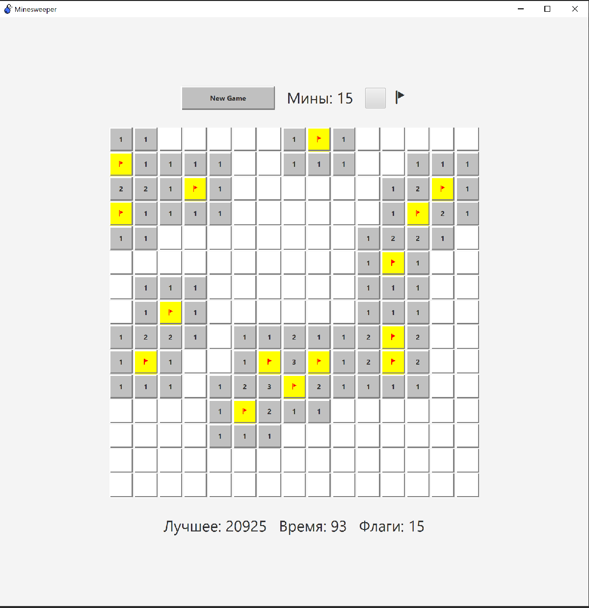

# 💣 Minesweeper in Scala

A classic Minesweeper implementation with:

- **Pure functional core** (immutable game logic)
- **Console interface** (planned)
- **Native JavaFX GUI** (cross-platform)

Perfect for learning functional programming, game logic, and ScalaFX!



---

## 🧠 Architecture

The project is split into modules:

### `core`

- **Pure Scala 2.13** — no dependencies except ScalaTest
- Immutable `Board` and `Game` with ADT-based interaction (`RevealResult`)
- Encapsulated mine positions (no cheating!)
- Property-safe types (`NonNegativeInt`)

### `gui`

- **ScalaFX** (JavaFX wrapper for Scala)
- New game selection with size/difficulty options
- Responsive game board with emoji icons

---

## 🚀 Installation & Run

### Option 1: Prebuilt Executable (Windows)

1. Download [`minesweeper.exe`](https://github.com/unknown030405/scala-minesweeper/releases) from **Releases**
2. Double-click to run — **no Java installation required!**

### Option 2: From JAR (All Platforms)

1. Install **Java 17+** with JavaFX (I used: [Azul Zulu FX](https://www.azul.com/downloads/?package=jre-fx))
2. Download [`minesweeper.jar`](https://github.com/unknown030405/scala-minesweeper/releases)
3. Run:
   ```bash
   java -jar minesweeper.jar
   ```

### Option 3: From Source

#### requires

- sbt

```bash
git clone https://github.com/unknown030405/scala-minesweeper.git
cd scala-minesweeper
sbt gui / run
```

---

## 📝 License

MIT — feel free to use in your projects!

---

## 🙌 Acknowledgements

- [ScalaFX](https://scalafx.org) — modern JavaFX for Scala
- [Azul Zulu FX](https://www.azul.com) — JavaFX-enabled JDK/JRE
- Classic Minesweeper gameplay logic